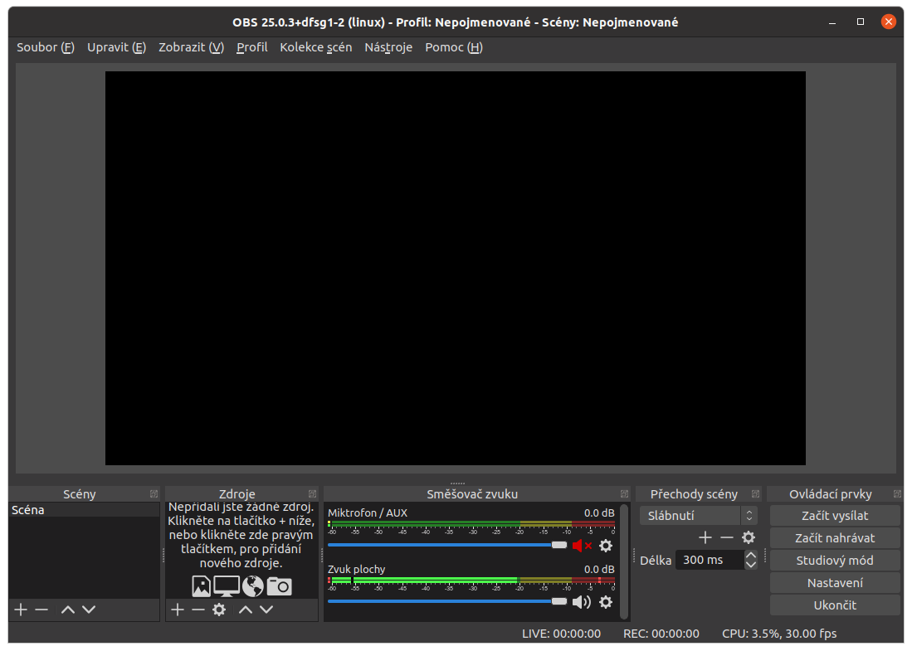
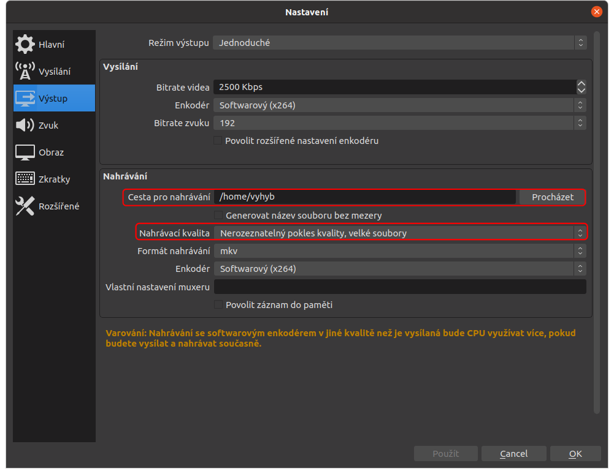
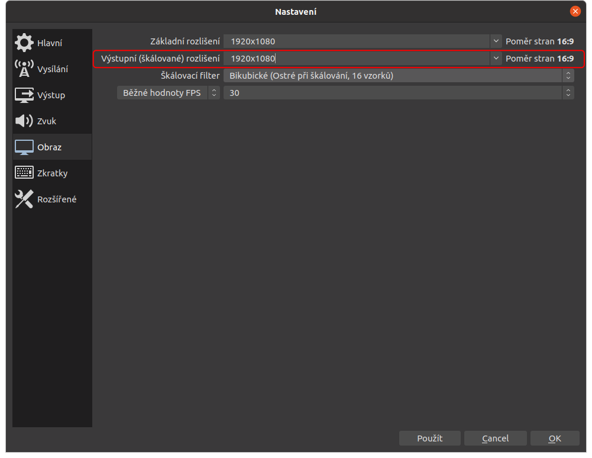
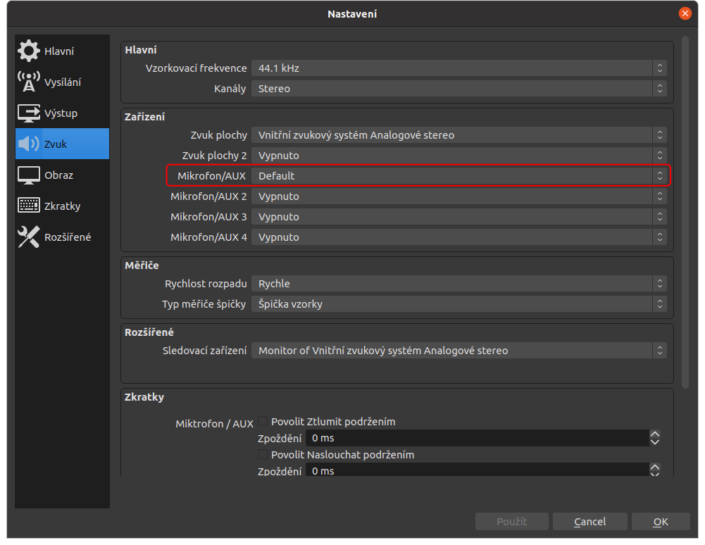

Strukturovanější doplněk k videu https://youtu.be/MLdPhW72ijM
# Jak na vzdálenou výuku (část 1) - Úvod do OBS studia

V tomto (možná) vícedílném seriálu se zkusíme podívat na možnosti předtáčení či streamování výukových videí za pomoci volně dostupného softwaru. Autor v tomto směru není žádným profesionálem ani v oblasti AV-inženýrství, ani v oblasti pedagogiky, pouze amatérem v prvním z obou zmíněných disciplín a zkušený koukač přes rameno svého otce - zvukaře.

V této první kapitole si zkusíme nainstalovat a získat zevrubný přehled o softwaru OBS studio hojně používaném právě pro natáčení a steamování záznamu nejen obrazovky.
## Instalace OBS

Pro instalaci OBS musíme navštívit stránku https://obsproject.com/cs/download a stáhnout si instalační balíček odpovídající našemu operačnímu systému. Ten následně spustit a provést instalaci dle všech doporučení.

## Prostředí OBS

Při spuštění OBS Studia je okno rozděleno do živého náhledu v horní části a do pěti panelů části dolní.

### Směšovač zvuku
V tomto panelu vidíte náhled aktuálně používaných vstupních audio signálů, v základním případě Mikrofon a Zvuky plochy. Je zde možné posuvníkem měnit hlasitost, poklepáním na ikonu reproduktoru vstup ztlumit a ozubené kolo vyvolá nabídku zahrnující dvě důležité položky - Filtry a Rozšířené vlastnosti zvuku

### Zdroje
V tomto panelu je možné zpravovat vstup obrazu. Pomocí tlačítka + je možné přidat cokoliv právě potřebujeme. Základními možnostmi jsou **Záznam obrazovky**, **Záznam okna** a **Zařízení pro záznam obrazu**, což je jinak řečeno vaše kamera.

Záznam obrazovky je asi nejjednodušší z uvedených možností, protože jednoduše zaznamenává vše, co se děje na zvolené obrazovce. 

Záznam okna naproti tomu umožňuje vybrat právě jedno okno a to zobrazovat bez ohledu na to, čím je právě reálně zakryto.

### Scény
Scény umožňují vytvořit na sobě nezávislé sestavy zdrojů, mezi kterými je pak možné jednoduše přeskakovat.

### Živý náhled
V rámci živého náhledu je možné upravovat pozici a velikost jednotlivých zdrojů.

### Ovládací prvky
Zde jednak spouštíme vysílání a nahrávání, ale zároveň se zde můžeme dostat do nastavení, kde je možné upravit kvalitu záznamu videa, nebo zvuková zařízení.

## Nastavení
V sekci nastavení jsou pro nás většinou důležité pouze některé položky. Na kartě výstup to je především sekce nahrávání, kde je možné změnit destinaci a formát nahraného videa.

Po instalaci OBS samo nastaví (pokud dostane souhlas) doporučenou kvalitu nahrávání videa. To je dodatečně možné změnit v nastavení na kartě **Obraz**.

Na kartě zvuk je poté možno upravit ještě zařízení pro záznam zvuku. To je nutné zejména v případě že nepoužíváme výchozí mikrofon. 
