Strukturovanější doplněk k videu 

# Jak na vzdálenou výuku (část 3) - Propojení OBS a MS Teams

Po úvodu do OBS a poznámkách týkajících se zvuku se dostáváme k důležité kapitole: Jak využít OBS při výuce v reálném čase?

Samozřejmě, v minulém tutorialu jsme cíleně nastavovali audio tak, aby ho bylo možné použít v různých aplikacích, ale co když nás vnější okolnosti lákají nebo nutí k použití funkcionality OBS v podobě separace zdrojů nebo přepínání scén? 

V takovém případě máme dvě základní možnosti:

1.   Streamování videa
2.   Nastavení virtuální webkamery

Oběma variantám se budeme podrobněji věnovat v následujících kapitolách, pokaždé ve spojení s MS Teams, a to ne kvůli jakékoli jedičnosti této aplikace, ale pouze kvůli její rozšířenosti v rámci výuky. Tento návod by měl být samozřejmě z větší části aplikovatený i na ostatní software.

## Streamování videa z OBS do MS Stream

Uvažujeme-li, že máme nastavené OBS pro nahrávání videa a audia podle minulých návodů, zbývá nám poměrně málo kroků.

### Postup vytvoření streamu
Pro vytvoření živé události je nutné jít do **kalendáře** aplikace MS Teams a tam zvolit **Nová schůzka** a **Živá událost**.

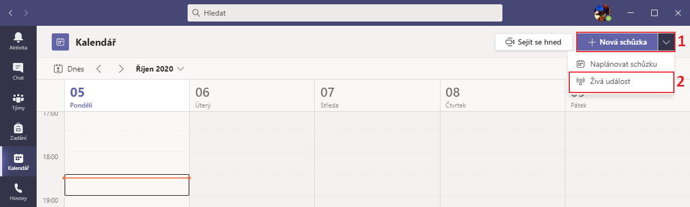

Jako první v nastavení události je nutné nastavit její **jméno a čas konání**.

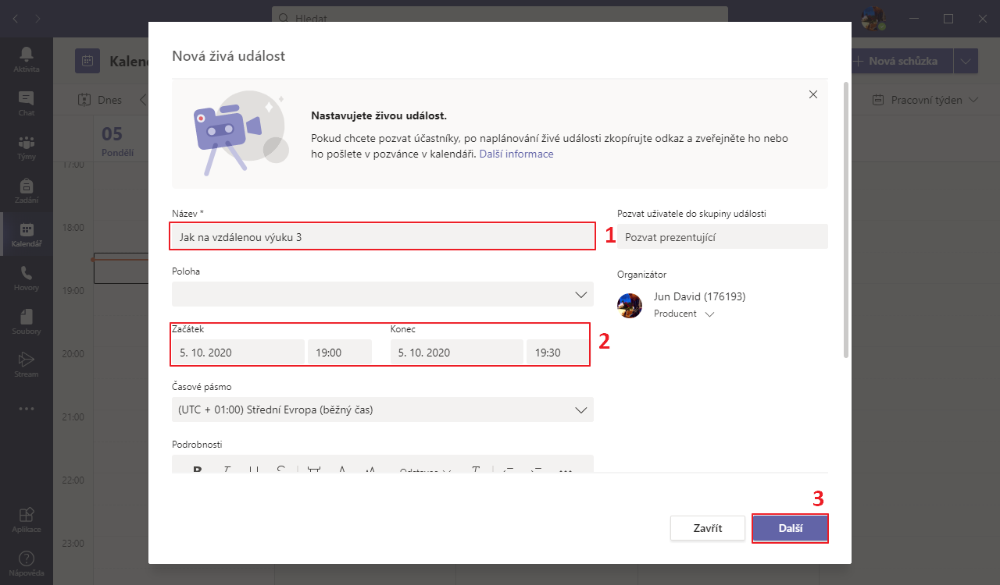

Poté nastavíme, kdo bude mít k videu **přístup**. Video nenastavujeme veřejné.

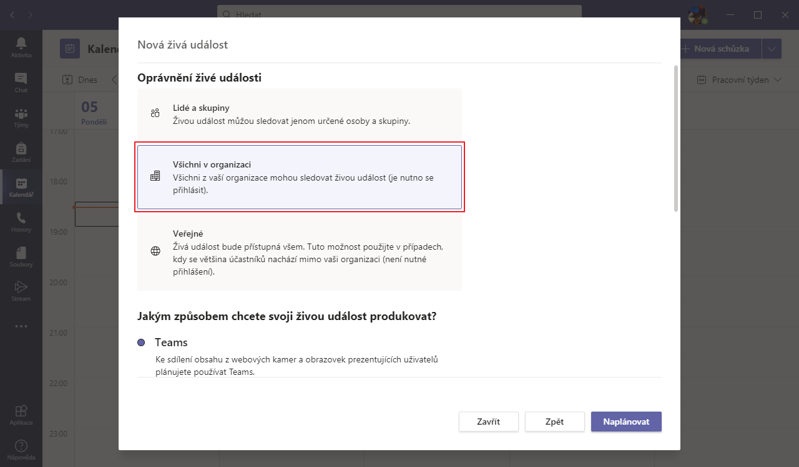

Scrollujeme níže a zvolíme možnost produkce na **Externí aplikace nebo zařízení**.

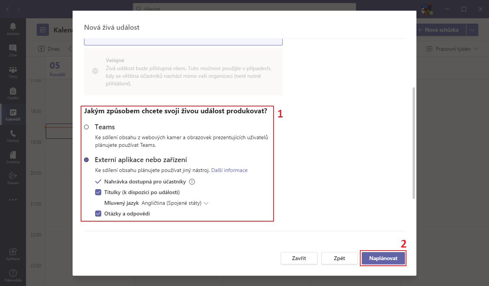

V dalším kroku získáme **odkaz pro účastníky**.

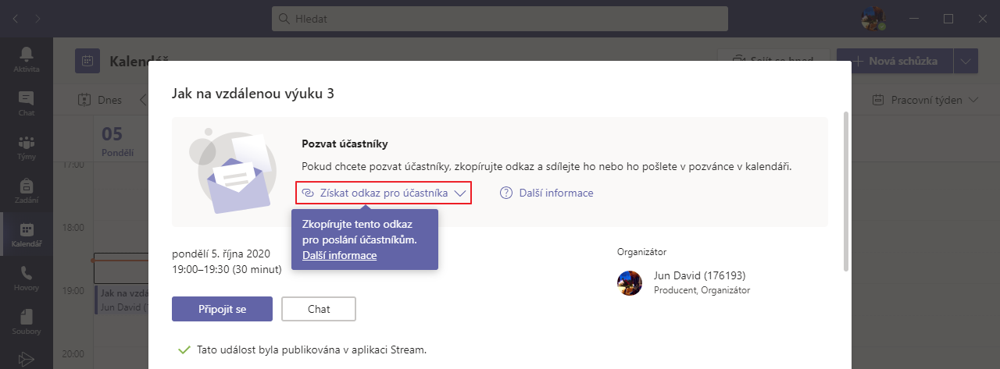

Nasledně scrollujeme níže a otevřeme odkaz na webové rozhraní služby **MS Stream**.

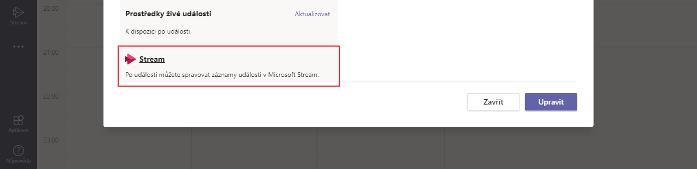

Zde vyvoláme nastavení **Aktualizovat podrobnosti o videu**.

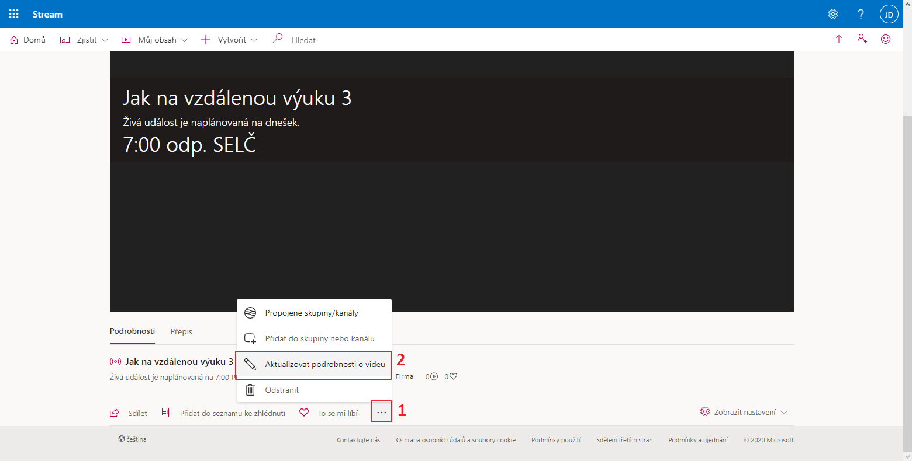

Poté zkopírujeme adresu **URL ingestace serveru** a spustíme **nastavování streamu**.

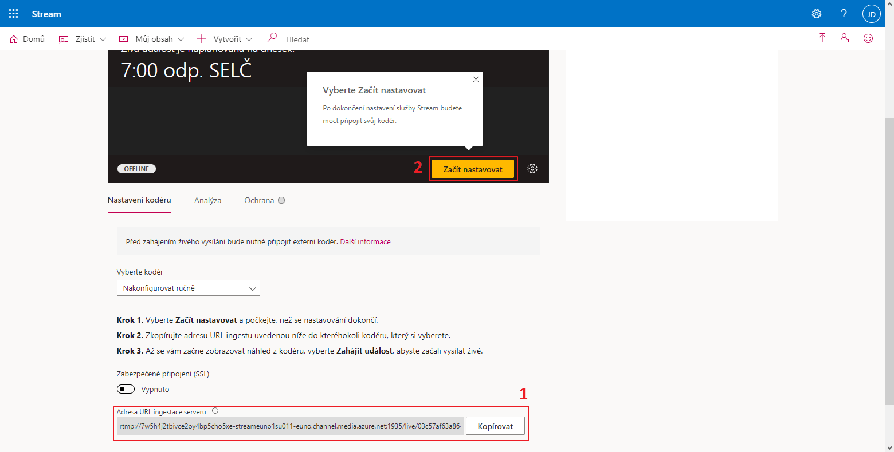

Jdeme do **nastavení OBS**, kde na kartě **Vysílání** zvolíme službu Vlastní..., vložíme zkopírované URL a zadáme libovolný (povinný) Vysílací klíč.

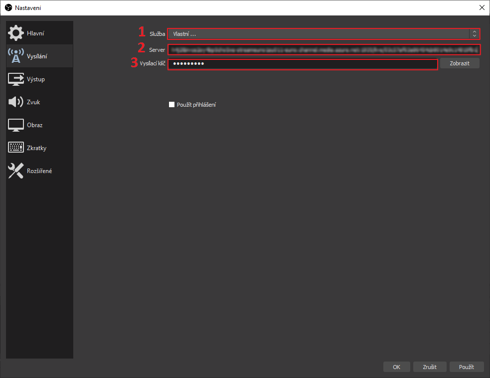

Zkontrolujeme stav streamu v prohlížeči a pokud je stream připraven na připojení, můžeme v OBS spustit vysílání.

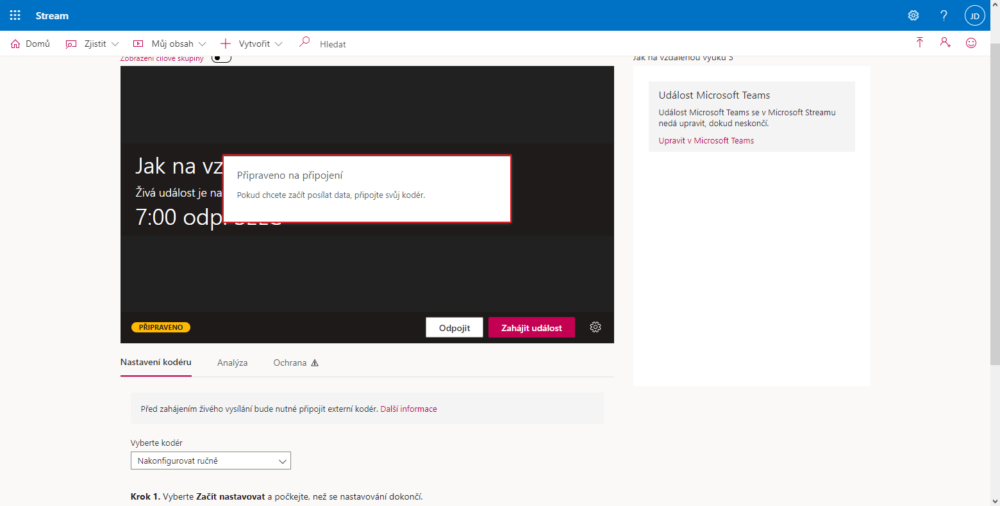

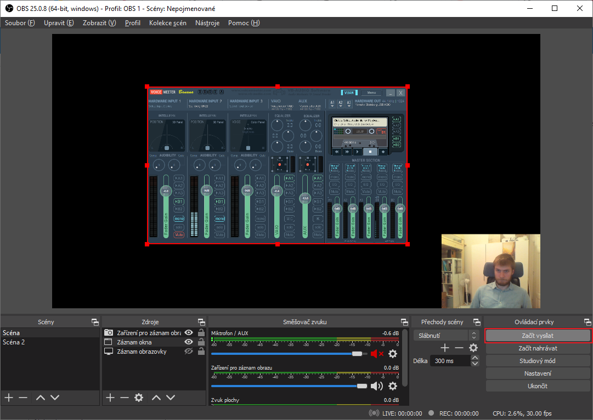

Dále už je potřeba pouze událost spustit.

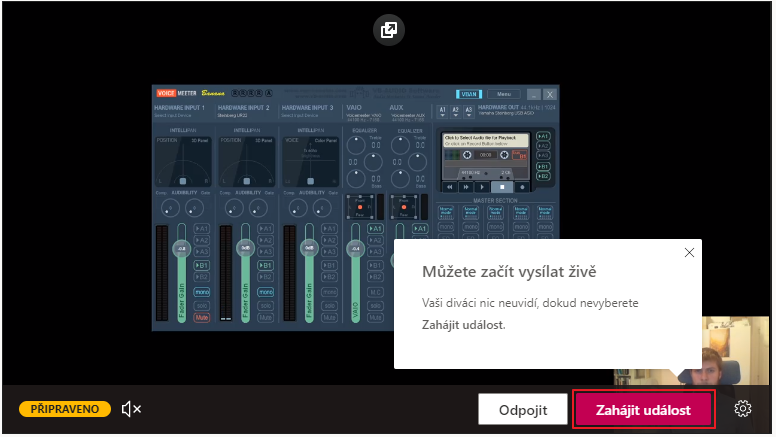

A ukončit.

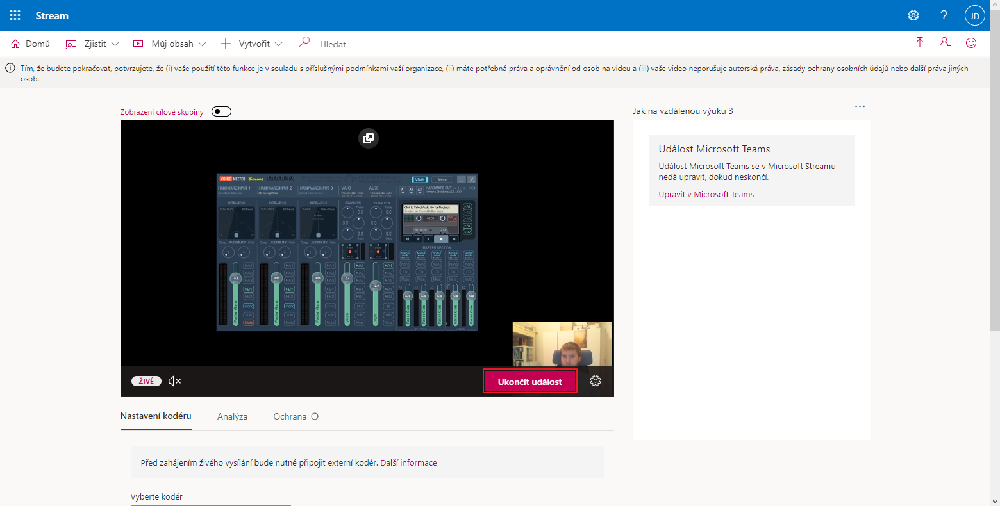

### Výhody a nevýhody

Hlavní výhodou tohoto přístupu by měla být hlavně stabilita audio i video kvality, naproti tomu hlavní nevýhodou je poměrně velká latence vysílání. Z toho můžeme hlavní využití tohoto přístupu shrnout na webináře, přednášky a výklady, při kterých není vyžadována okamžitá interakce s posluchačem.

## Vytvoření virtuální webkamery pro videohovory

Alternativou k výše zmíněnému je instalace rozšíření OBS pod názvem [OBS Virtualcam](https://obsproject.com/forum/resources/obs-virtualcam.949/) pro Windows, v případě využívání Macu [obdobný plugin](https://github.com/johnboiles/obs-mac-virtualcam), nebo v případě Linuxu rozšíření [OBS V4L2sink](https://github.com/CatxFish/obs-v4l2sink).

Všechna tato rozšíření umožňují vytvoření virtuální webkamery zobrazující živý náhled v OBS. Tu je dále možné použít v téměř libovolném videohovoru.

My se budeme dále věnovat pouze variantě pro Windows.

### Instalace a nastavení

Z [repozitáře](https://github.com/Fenrirthviti/obs-virtual-cam/releases) nejdříve stáhneme instalační balíček pro windows.

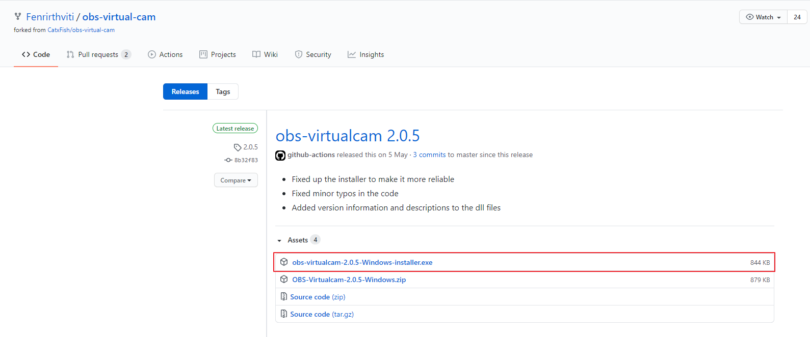

Nainstalujeme rozšíření a spustíme OBS.

V OBS rozklikneme v horní liště **Nástroje** a **VirtualCam**.

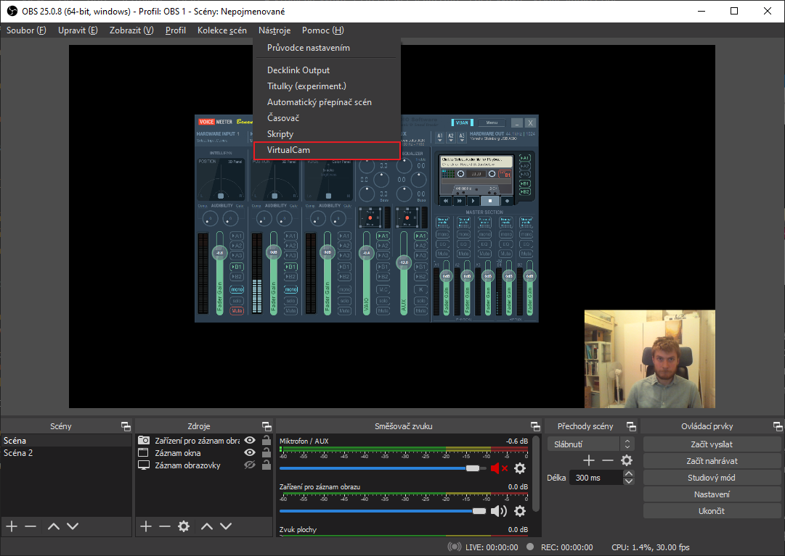

Spustíme virtuální kameru tlačítkem **Start**.

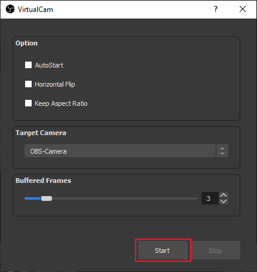

Otevřeme nastavení MS Teams.

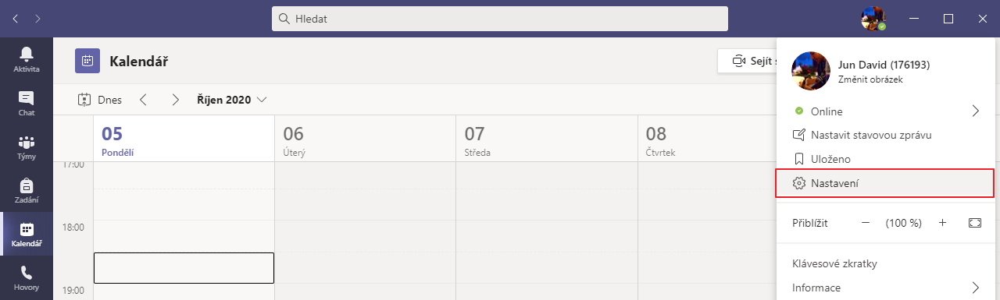

V tomto okamžiku by se měla kamera objevit v **nastavení MS Teams**, případně může být nutné Teams **restartovat**, aby došlo k obnovení seznamu dostupných zařízení.

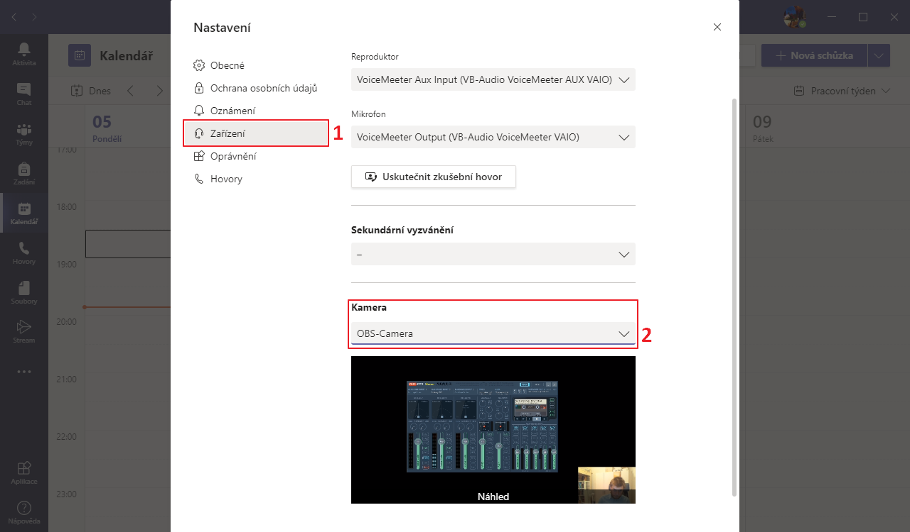

Následně už je pouze nutné zjistit metodou pokus omyl, zda je obraz **zdrcadlený či nikoliv** z pohledu účastníka schůzky. (Tento fakt se může lišit od náhledu v nastavení aplikace). 

Pokud je zrcadlení opačné, lze ho změnit v rozšíření VirtualCam (položka **Horizontal Flip**). To může způsobovat jeho pád. V takovém případě je nutné zrcadlit scénu nebo obraz v nastavení videokonference (což není umožněno v MS Teams).

Po konci videohovoru nám nezbývá nic než zastavit virtuální kameru.

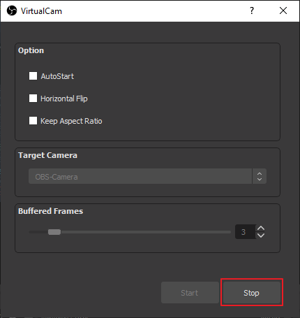

### Výhody a nevýhody
Hlavní výhodou tohoto přístupu je nízká latence vysílání zvuku i videa, což může být nezbytné při seminářích a cvičeních, kde se vyžaduje interance s posluchači. Naproti tomu kvalita obrazu může lehce pokulhávat.

Je třeba zmínit, že samotné MS Teams nabízí značnou podporu výuky, takže je dobré doporučit prvně důkladné prozkoumání těchto možností a poté je doplnit třeba jen o vylepšení zvuku.

